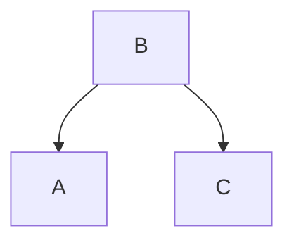
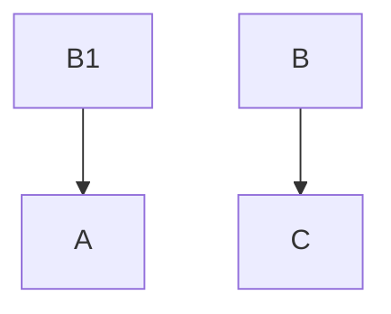

# Dawn Sql 企业应用的设计思想
## 1、通常企业应用的架构
### 1.1、微服务架构
微服务架构在目前市场上用的比较多，也是很主流的架构，这种架构来至互联网的架构其实是增加了企业应用开发的难度，增加了企业应用的开发成本！对！你没有看错！企业可以在实施微服务架构和没有实施之前的投入做一个比较就看到会非常明显成本增长了。
<table border="1" cellspacing="0" cellpadding="0" align="center">
   <thead>
       <tr>
          <th>技术关键项</th>
          <th>微服务系统</th>
          <th>业务场景描述和要求</th>
       </tr>
   </thead>
   <tbody>
      <tr>
         <td>
            系统边界的划分
         </td>
         <td>
            1、拆分业务。<br/>
            2、拆分数据。<br/>
              缺点：1、对业务有入侵性。<br/>
                   2、数据的一致性和事务。<br/>
                   3、性能下降。<br/>
                   4、服务之间相互依存，相应调用的地方变多，变复杂。<br/>
             解决方案：<br/>
             1、使用分库分表来应对数据的增长。<br/>
             2、使用分布式事务框架应对分布式的要求例如：<br/>seeta 但是无法解决性能问题。
         </td>
         <td>
             真实的业务场景中系统之间往往是界限不清晰的。<br/>往往是一张表，
             几个系统都在使用。<br/>而且还有事务的要求。
         </td>
      </tr>
     <tr>
        <td>分布式事务</td>
        <td>在主流微服务体系中，一般采用 mysql或者PostgreSQL 数据库。
<br/>所以它本身不支持。
<br/>解决方案有三种：<br/>
1、TCC。<br/>
2、消息队列。<br/>
3、开源的分布式事务框架。<br/>
缺点：1、性能低。<br/>
2、对业务有入侵性。开发难度高<br/></td>
        <td>在金融场景中，不能出现任何错误！<br/>对事务是有严格的要求。<br/>
        </td>
      </tr>
      <tr>
        <td>数据库和缓存双写一致性</td>
        <td>1、Cache aside<br/>
          2、Read through<br/>
          3、Write through<br/>
          4、Write behind caching<br/>
          这四中模式均有优劣，不能完美的解决问题<br/>
          且开发成本高
        </td>
        <td>在实际的业务中，需要缓存来提升效率，<br/>同时也要保证缓存和数据库的事务性</td>
      </tr>
     <tr>
        <td>开发复杂性</td>
        <td>1、微服务体系对技术要求不仅仅是，<br/>
服务发现、配置中心、授权管理、还包括服务治理。<br/>
服务注册与发现的主动健康检查、故障处理和恢复<br/>
（超时、熔断、限流、重试）、RPC支持、HTTP/2支持、协议转换和提升。<br/>
加密、认证/授权/鉴权机制、分布式追踪、监控。<br/>
需要开发团队成员都是该领域内的专家。<br/>
2、对业务的入侵性，<br/>
造成两个不足：<br/>
2.1、开发效率的降低。<br/>2.2、维护成本的增加（完整性、事务、状态<br/></td>
        <td>金融行业的业务复杂，规则特别多，<br/>受监管要求的也多，<br/>
这就要求金融的系统灵活、快速、稳定</td>
      </tr>
     <tr>
        <td>运营复杂性</td>
        <td>微服务拆分的越多，运维就会变的很困难。<br/>
        因为服务越多，服务之间的通信链路就会越多，<br/>服务之间的相互调用也会更多，<br/>那么出错的可能性就会越大。</td>
        <td></td>
      </tr>
      <tr>
        <td>系统性能</td>
        <td>微服务架构要维护所有服务的，<br/>高可用性、数据的完整性、事务性、状态等。<br/>造成了微服务架构的复杂。<br/>所以微服务架构的效率会比较低</td>
        <td></td>
      </tr>
   </tbody>
</table>

### 1.2、基于 hadoop 的体系的大数据架构
现在大数据的架构一般采用 hadoop 作为数据源。用 hive、spark、flink 来操作数据。因此第一步就是要将数据导入到 hadoop 集群。通常使用 sqoop 来完成这不操作，但是不排除导入数据不完整或者是错误。
Hive/spark/flink 因为读取的是 hadoop 上的文件，所以数据没有像关系型数据库那样的索引。
这样有如下弊端：
1、对多表 join 执行很慢 （绝大多数情况下都无法满足业务的要求）。
2、对多表的 join\order by \group by 以及聚合参数，会造成大量的mapreduce。效率低，可用性差。
3、对于复杂过程的数据抽取，通用的解决方案就是形成一张宽表，然而因为实际业务的特点，这样的宽表通常都有几百列甚至几千列。这样给运行和运维这样的宽表带来风险和挑战。
例如：一条 sql 语句就可以 outofmemory 造成整个系统不可以用。
4、形成宽表的过程，可能非常复杂，而增加相应的开发量和资源消耗。

## 2、 DawnSql 的目标
**建立以业务为中心的，全新的开发模式**
1. 必须极大的降低成本。包括且 限于:开发成本、设备成本、维护成本、管理成本等
2. 建立新的开发体系，能在本质上提升IT服务的质量和响应业务的速度，以适应业务的快速发展
3. 实现业务经营的数据化、智能化，为市场的发展提供有效指导。

## 3、函数式架构的思想
背景：在企业应用中，对已有系统，开发需求，是否越开发越难，随着时间的推移，人员的流动，系统越来越无法维护，新的需求 bug 越来越多？系统的代码，逐步成为了一堆 "屎山"。每次做新的需求前需要仔仔细细的对 "屎山"进行考古，即使这样也不能完全保证，新的需求上去会不会影响现有的功能或者性能。

**上面问题的本质，就是系统的 "可变性" 造成的！**

### 1、现在通常的企业应用架构
现有的软件架构中，架构师们往往强调，业务共享，例如：有三个业务 A, B, C 其中 A 和 C 共享 B。本来岁月静好，没有想到 A 的业务给 A 提了一个需求，而这个需求，需要修改 B 才能完成，而修改的 B 还不能影响 C 的功能实现。因此就必须写一个新的 B 来适配 A 的新需求，同时还得满足 C 的功能实现。当业务的规模发展太快或者行业规则变化太快时就会有很多这样的需求，而业务早就不是 A B C ... N 了。这样的话，当年的小甜甜就变成了牛夫人，大家发现随着业务的发展，开发人员正常的替换，共享的业务代码会越来越臃肿，越来越不可维护， 逻辑也越来越混乱。直到最后彻底无法满足业务的需求。

例如：
一个开始，A C 共享 B 业务

 A 的业务给 A 提了一个需求，而这个需求，需要修改 B 才能完成，而修改的 B 还不能影响 C 的功能实现。B版本1 适配 A 的新需求，同时还得满足 C 的功能实现。
 ```mermaid
graph TB;
  B版本1-->A
  B版本1-->C
 ```
随着业务的发展，行业规则，监管的变化。共享的代码适配的功能就会越来越多，越来越复杂。

#### 2、函数式企业应用架构的原则是 -- 业务隔离，而不是共享
也是用上面的例子，如果 A 有新的需求需要修改 B ，在函数式架构中，复制一份 B 出来，取名为 B1 直接修改里面的代码即可，不用考虑是否还兼容 C 的问题。这个 B1 就是 A 独享的。随着业务的发展，也不会出现代码臃肿，逻辑混乱，不可维护的情况，因为业务代码的流程非常清晰，且实现了业务的隔离，一个业务的变化，不会影响其它业务的改变！



**函数式架构的思想来至与函数式编程。强调业务的不可变性！事实上，函数式的思想是最符合人类的思维的。**

*这里有人可能会有一个疑问："既然函数式有这么多优点，为什么现在大多数还是命令式的？"。这个就要说到编程语言的发展了，其实最早的编程语言，就是函数式的 lisp 语言。因为函数式语言的不可变性，惰性求值的特点，使得中间的计算过程产生的值无法共享给其它程序。在当时计算机硬件落后的情况下，这种特点就不如，命令式高效了。例如：命令式语言 C/C++/JAVA 等，在运算过程中对变量进行赋值，而其他的线程也可以访问和修改这个变量，使得这个变量被其它线性所共享。也就是说只需要计算一次，其它的都共享这个结果。这显然比函数式要高效。但是随着计算机硬件的发展多核多线程，成为主流，命令式语言的共享，带来了严重安全和性能问题，因为线程等待会严重的影响性能，而函数式都是不可变的，所以在多核多线程下，它会拥有更好的性能和开发效率。*

### 3、函数式应用架构的难点
#### 3.1、根据业务对数据权限控制。让其业务在数据层面隔离。
#### 3.2、对相应的业务的代码和相关联的代码，进行复制的能力
