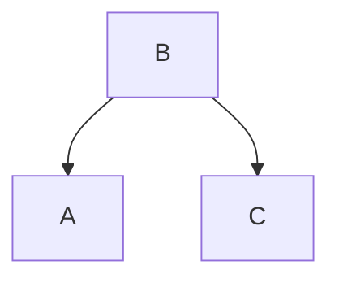
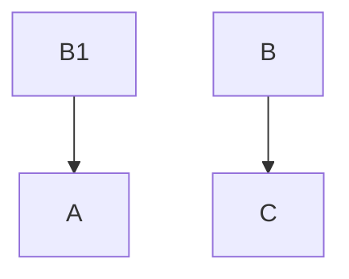

## 函数式架构的思想
背景：在企业应用中，对已有系统，开发需求，是否越开发越难，随着时间的推移，人员的流动，系统越来越无法维护，新的需求 bug 越来越多？系统的代码，逐步成为了一堆 "屎山"。每次做新的需求前需要仔仔细细的对 "屎山"进行考古，即使这样也不能完全保证，新的需求上去会不会影响现有的功能或者性能。

**上面问题的本质，就是系统的 "可变性" 造成的！**

### 1、现在通常的企业应用架构
现有的软件架构中，架构师们往往强调，业务共享，例如：有三个业务 A, B, C 其中 A 和 C 共享 B。本来岁月静好，没有想到 A 的业务给 A 提了一个需求，而这个需求，需要修改 B 才能完成，而修改的 B 还不能影响 C 的功能实现。因此就必须写一个新的 B 来适配 A 的新需求，同时还得满足 C 的功能实现。当业务的规模发展太快或者行业规则变化太快时就会有很多这样的需求，而业务早就不是 A B C ... N 了。这样的话，当年的小甜甜就变成了牛夫人，大家发现随着业务的发展，开发人员正常的替换，共享的业务代码会越来越臃肿，越来越不可维护， 逻辑也越来越混乱。直到最后彻底无法满足业务的需求。

例如：
一个开始，A C 共享 B 业务

 A 的业务给 A 提了一个需求，而这个需求，需要修改 B 才能完成，而修改的 B 还不能影响 C 的功能实现。B版本1 适配 A 的新需求，同时还得满足 C 的功能实现。
 ```mermaid
graph TB;
  B版本1-->A
  B版本1-->C
 ```
随着业务的发展，行业规则，监管的变化。共享的代码适配的功能就会越来越多，越来越复杂。

### 2、函数式企业应用架构的原则是 -- 业务隔离，而不是共享
也是用上面的例子，如果 A 有新的需求需要修改 B ，在函数式架构中，复制一份 B 出来，取名为 B1 直接修改里面的代码即可，不用考虑是否还兼容 C 的问题。这个 B1 就是 A 独享的。随着业务的发展，也不会出现代码臃肿，逻辑混乱，不可维护的情况，因为业务代码的流程非常清晰，且实现了业务的隔离，一个业务的变化，不会影响其它业务的改变！



**函数式架构的思想来至与函数式编程。强调业务的不可变性！事实上，函数式的思想是最符合人类的思维的。**

*这里有人可能会有一个疑问："既然函数式有这么多优点，为什么现在大多数还是命令式的？"。这个就要说到编程语言的发展了，其实最早的编程语言，就是函数式的 lisp 语言。因为函数式语言的不可变性，惰性求值的特点，使得中间的计算过程产生的值无法共享给其它程序。在当时计算机硬件落后的情况下，这种特点就不如，命令式高效了。例如：命令式语言 C/C++/JAVA 等，在运算过程中对变量进行赋值，而其他的线程也可以访问和修改这个变量，使得这个变量被其它线性所共享。也就是说只需要计算一次，其它的都共享这个结果。这显然比函数式要高效。但是随着计算机硬件的发展多核多线程，成为主流，命令式语言的共享，带来了严重安全和性能问题，因为线程等待会严重的影响性能，而函数式都是不可变的，所以在多核多线程下，它会拥有更好的性能和开发效率。*

### 3、函数式应用架构的难点
#### 3.1、根据业务对数据权限控制。让其业务在数据层面隔离。
#### 3.2、对相应的业务的代码和相关联的代码，进行复制的能力


