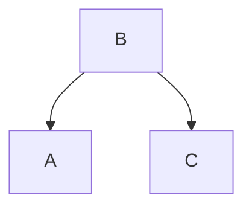
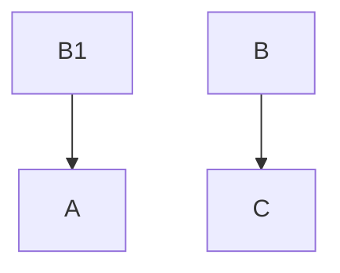

# 精通 Smart Sql

>Smart Sql 是革命性的技术。因为它符合革命性技术的两大特征！
>1、极大的提高了用户的使用体验！
>2、从根本上提高了产能！

## 5分钟运行一个 Smart Sql 程序 -- "Hello Smart Sql"
### 1、SmartSql 是什么？
1. SmartSql 是一个基于 apache ignite 支持水平扩展和容错的分布式计算平台，可以在 TB 级数据上以内存级的速度构建实时应用。
2. SmartSql 不仅支持完整的 SQL, NoSql。<span style="color:red;font-weight: bold">最关键的是支持自定义的 SQL方法</span>
3. SmartSql 是一个自带分布式缓存、分布式事务、分布式计算平台的超级分布式数据库。
4. SmartSql 拥有良好的扩展性，用户可以自己扩展 SQL 的方法，让 SmartSql 兼容各种系统。
5. SmartSql 是一种以业务为中心的，全新的开发模式。以最稳定、最高效、最灵活、最智能的方式，满足市场变化对业务提升的要求。

### 2、SmartSql 的优势是什么？
1. SmartSql 学习成本、开发成本、维护成本极低
2. SmartSql 开发效率极高，只需要简单的 sql 组合就可以开发出性能稳定、效率极高的程序
3. SmartSql 能够无缝对接机器学习的算法
4. SmartSql 能够快速灵活的和工程做融合
5. SmartSql 能极大的赋能业务，降本增效

### 3、环境要求
1. JDK：Oracle JDK8及以上，Open JDK8及以上，IBM JDK8及以上
2. OS：Linux（任何版本），Mac OS X（10.6及以上），Windows(XP及以上)，Windows Server（2008及以上），Oracle Solaris
3. 网络：没有限制（建议10G甚至更快的网络带宽）
4. 架构：x86，x64，SPARC，PowerPC

### 4、安装并激活 SmartSql
下载: SmartSql(压缩包) 
  在命令行中转到安装文件夹的bin目录：
```shell
> cd {SmartSql}/bin/ 
```

Linux Mac 下启动：<br/>
```shell
> ./SmartSql.sh
```

Windows 下启动：<br/>
```shell
> ./SmartSql.bat
```

激活集群<br/>
Linux/Mac 下激活集群：<br/>
```shell
> ./control.sh --activate
```

Windows 下激活集群：<br/>
```shell
> ./control.bat --activate
```

### 5、开发 SmartSql 代码

#### 5.1、DBeaver 连接分布式数据库
创建新建连接


*SmartSql 在 Apache Ignite 上修改的，所以这里选择 Apache Ignite *


点击**编辑驱动设置**


1、url 模板必须添加 userToken 否则是不能连接数据库的。SmartSql 是通过 userToken 来获取用户或者应用程序权限的。
例子中的 userToken=dafu。 dafu 这个值是在配置文件中配置的 root 权限的 token。用户权限的 token 通过 root 用户来生成。


2、添加文件，最简单的就是把安装文件夹下面的 jar 添加进来

3、点击**找到类** 选择：org.apache.ignite.Ignite.JdbcDriver 。如图上所示

在 DBeaver 中输入如下代码：
```sql
function helloWorld(msg:String)
{
    show_msg(msg);
}
helloWorld('Welcome to Smart Sql！');
```
运行将会得到如下结果：


定义一个 helloWorld 的方法，输入字符串，在打印出来。

## Smart Sql 企业应用的设计思想
### 1、通常企业应用的架构
#### 1.1、微服务架构
微服务架构在目前市场上用的比较多，也是很主流的架构，这种架构来至互联网的架构其实是增加了企业应用开发的难度，增加了企业应用的开发成本！对！你没有看错！企业可以在实施微服务架构和没有实施之前的投入做一个比较就看到会非常明显成本增长了。
<table border="1" cellspacing="0" cellpadding="0" align="center">
   <thead>
       <tr>
          <th>技术关键项</th>
          <th>微服务系统</th>
          <th>业务场景描述和要求</th>
       </tr>
   </thead>
   <tbody>
      <tr>
         <td>
            系统边界的划分
         </td>
         <td>
            1、拆分业务。<br/>
            2、拆分数据。<br/>
              缺点：1、对业务有入侵性。<br/>
                   2、数据的一致性和事务。<br/>
                   3、性能下降。<br/>
                   4、服务之间相互依存，相应调用的地方变多，变复杂。<br/>
             解决方案：<br/>
             1、使用分库分表来应对数据的增长。<br/>
             2、使用分布式事务框架应对分布式的要求例如：<br/>seeta 但是无法解决性能问题。
         </td>
         <td>
             真实的业务场景中系统之间往往是界限不清晰的。<br/>往往是一张表，
             几个系统都在使用。<br/>而且还有事务的要求。
         </td>
      </tr>
     <tr>
        <td>分布式事务</td>
        <td>在主流微服务体系中，一般采用 mysql或者PostgreSQL 数据库。
<br/>所以它本身不支持。
<br/>解决方案有三种：<br/>
1、TCC。<br/>
2、消息队列。<br/>
3、开源的分布式事务框架。<br/>
缺点：1、性能低。<br/>
2、对业务有入侵性。开发难度高<br/></td>
        <td>在金融场景中，不能出现任何错误！<br/>对事务是有严格的要求。<br/>
        </td>
      </tr>
      <tr>
        <td>数据库和缓存双写一致性</td>
        <td>1、Cache aside<br/>
          2、Read through<br/>
          3、Write through<br/>
          4、Write behind caching<br/>
          这四中模式均有优劣，不能完美的解决问题<br/>
          且开发成本高
        </td>
        <td>在实际的业务中，需要缓存来提升效率，<br/>同时也要保证缓存和数据库的事务性</td>
      </tr>
     <tr>
        <td>开发复杂性</td>
        <td>1、微服务体系对技术要求不仅仅是，<br/>
服务发现、配置中心、授权管理、还包括服务治理。<br/>
服务注册与发现的主动健康检查、故障处理和恢复<br/>
（超时、熔断、限流、重试）、RPC支持、HTTP/2支持、协议转换和提升。<br/>
加密、认证/授权/鉴权机制、分布式追踪、监控。<br/>
需要开发团队成员都是该领域内的专家。<br/>
2、对业务的入侵性，<br/>
造成两个不足：<br/>
2.1、开发效率的降低。<br/>2.2、维护成本的增加（完整性、事务、状态<br/></td>
        <td>金融行业的业务复杂，规则特别多，<br/>受监管要求的也多，<br/>
这就要求金融的系统灵活、快速、稳定</td>
      </tr>
     <tr>
        <td>运营复杂性</td>
        <td>微服务拆分的越多，运维就会变的很困难。<br/>
        因为服务越多，服务之间的通信链路就会越多，<br/>服务之间的相互调用也会更多，<br/>那么出错的可能性就会越大。</td>
        <td></td>
      </tr>
      <tr>
        <td>系统性能</td>
        <td>微服务架构要维护所有服务的，<br/>高可用性、数据的完整性、事务性、状态等。<br/>造成了微服务架构的复杂。<br/>所以微服务架构的效率会比较低</td>
        <td></td>
      </tr>
   </tbody>
</table>

#### 1.2、基于 hadoop 的体系的大数据架构
现在大数据的架构一般采用 hadoop 作为数据源。用 hive、spark、flink 来操作数据。因此第一步就是要将数据导入到 hadoop 集群。通常使用 sqoop 来完成这不操作，但是不排除导入数据不完整或者是错误。
Hive/spark/flink 因为读取的是 hadoop 上的文件，所以数据没有像关系型数据库那样的索引。
这样有如下弊端：
1、对多表 join 执行很慢 （绝大多数情况下都无法满足业务的要求）。
2、对多表的 join\order by \group by 以及聚合参数，会造成大量的mapreduce。效率低，可用性差。
3、对于复杂过程的数据抽取，通用的解决方案就是形成一张宽表，然而因为实际业务的特点，这样的宽表通常都有几百列甚至几千列。这样给运行和运维这样的宽表带来风险和挑战。
例如：一条 sql 语句就可以 outofmemory 造成整个系统不可以用。
4、形成宽表的过程，可能非常复杂，而增加相应的开发量和资源消耗。

### 2、 SmartSql 的目标
**建立以业务为中心的，全新的开发模式**
1. 必须极大的降低成本。包括且 限于:开发成本、设备成本、维护成本、管理成本等
2. 建立新的开发体系，能在本质上提升IT服务的质量和响应业务的速度，以适应业务的快速发展
3. 实现业务经营的数据化、智能化，为市场的发展提供有效指导。

### 3、函数式架构的思想
背景：在企业应用中，对已有系统，开发需求，是否越开发越难，随着时间的推移，人员的流动，系统越来越无法维护，新的需求 bug 越来越多？系统的代码，逐步成为了一堆 "屎山"。每次做新的需求前需要仔仔细细的对 "屎山"进行考古，即使这样也不能完全保证，新的需求上去会不会影响现有的功能或者性能。

**上面问题的本质，就是系统的 "可变性" 造成的！**

#### 1、现在通常的企业应用架构
现有的软件架构中，架构师们往往强调，业务共享，例如：有三个业务 A, B, C 其中 A 和 C 共享 B。本来岁月静好，没有想到 A 的业务给 A 提了一个需求，而这个需求，需要修改 B 才能完成，而修改的 B 还不能影响 C 的功能实现。因此就必须写一个新的 B 来适配 A 的新需求，同时还得满足 C 的功能实现。当业务的规模发展太快或者行业规则变化太快时就会有很多这样的需求，而业务早就不是 A B C ... N 了。这样的话，当年的小甜甜就变成了牛夫人，大家发现随着业务的发展，开发人员正常的替换，共享的业务代码会越来越臃肿，越来越不可维护， 逻辑也越来越混乱。直到最后彻底无法满足业务的需求。

例如：
一个开始，A C 共享 B 业务

 A 的业务给 A 提了一个需求，而这个需求，需要修改 B 才能完成，而修改的 B 还不能影响 C 的功能实现。B版本1 适配 A 的新需求，同时还得满足 C 的功能实现。
 ```mermaid
graph TB;
  B版本1-->A
  B版本1-->C
 ```
随着业务的发展，行业规则，监管的变化。共享的代码适配的功能就会越来越多，越来越复杂。

#### 2、函数式企业应用架构的原则是 -- 业务隔离，而不是共享
也是用上面的例子，如果 A 有新的需求需要修改 B ，在函数式架构中，复制一份 B 出来，取名为 B1 直接修改里面的代码即可，不用考虑是否还兼容 C 的问题。这个 B1 就是 A 独享的。随着业务的发展，也不会出现代码臃肿，逻辑混乱，不可维护的情况，因为业务代码的流程非常清晰，且实现了业务的隔离，一个业务的变化，不会影响其它业务的改变！



**函数式架构的思想来至与函数式编程。强调业务的不可变性！事实上，函数式的思想是最符合人类的思维的。**

*这里有人可能会有一个疑问："既然函数式有这么多优点，为什么现在大多数还是命令式的？"。这个就要说到编程语言的发展了，其实最早的编程语言，就是函数式的 lisp 语言。因为函数式语言的不可变性，惰性求值的特点，使得中间的计算过程产生的值无法共享给其它程序。在当时计算机硬件落后的情况下，这种特点就不如，命令式高效了。例如：命令式语言 C/C++/JAVA 等，在运算过程中对变量进行赋值，而其他的线程也可以访问和修改这个变量，使得这个变量被其它线性所共享。也就是说只需要计算一次，其它的都共享这个结果。这显然比函数式要高效。但是随着计算机硬件的发展多核多线程，成为主流，命令式语言的共享，带来了严重安全和性能问题，因为线程等待会严重的影响性能，而函数式都是不可变的，所以在多核多线程下，它会拥有更好的性能和开发效率。*

#### 3、函数式应用架构的难点
##### 3.1、根据业务对数据权限控制。让其业务在数据层面隔离。
##### 3.2、对相应的业务的代码和相关联的代码，进行复制的能力

## 4、 Smart Sql 的设计
##  Smart Sql 的设计
SmartSql 是一个超融合的新的函数式理念，它要实现的功能相当于 分布式(mysql/pg) + 大数据体系 + 分布式缓存 + 应用程序。

### Smart Sql 的设置
#### 1、设置是否多用户组


设置多用户组为 true 后，就可以设置不同的数据集 (data set)。数据集是数据表的集合，也就是说数据集包含了一个或多个表。一个用户组只属于一个 DataSet。另外还有一个 public 数据集为公共数据集。
*数据集可以理解为一个子系统的数据库*
**具体的操作**

#### 1.1、添加数据集（Date Set）
```sql
-- 1、
-- 新增数据集 myy
create dataset if not exists myy;
-- 或者
create dataset myy;

-- 2、
-- 新增数据集 wudafu
create dataset if not exists wudafu;
-- 或者
create dataset wudafu;

-- 3、
-- 新增数据集 wudagui
create dataset if not exists wudagui;
-- 或者
create dataset wudagui;
```

如果要删除数据集
```sql
-- 1、
-- 删除数据集 myy
drop dataset if exists myy;
-- 或者
drop dataset myy;

-- 2、
-- 删除数据集 wudafu
drop dataset if exists wudafu;
-- 或者
drop dataset wudafu;

-- 3、
-- 删除数据集 wudagui
drop dataset if exists wudagui;
-- 或者
drop dataset wudagui;
```

#### 1.2、添加用户组。(需要 root 权限)
```sql
add_user_group(group_name, user_token, group_type, data_set_name);
```

内置方法 add_user_group 的实现：
```sql
-- 输入 data set name 获取 data set 的 id
function get_data_set_id(name:string)
{
    let id;
    -- 使用 query_sql 访问数据库读取 id
    for(r in query_sql("select m.id from my_dataset m where m.dataset_name = ?", name))
    {
        -- 读取出来的为序列，因为只有一列，所以我们就只取第一个
        id = r.first();
    }
    -- SmartSql 默认最后一条语句为返回值，所以必要有 id;
    id;
} 

-- 添加用户组
function add_user_group(group_name:string, user_token:string, group_type:string, data_set_name:string)
{
    -- 通过 data set name 获取 data set 的 id
    let data_set_id = get_data_set_id(data_set_name);
    match {
        -- data set id 大于 0 时，插入到 my_users_group 表中
        data_set_id > 0: query_sql("insert into my_users_group (id, group_name, data_set_id, user_token, group_type) values (auto_id(?), ?, ?, ?, ?)", ["my_users_group", group_name, data_set_id, user_token, group_type]);
        else false;
    }
}
```
*实际上用户可以自己实现这些方法*

**注意**
**如果是使用 DBeaver 可以使用一个特有的函数 loadFromNative(本地 sql 文件的地址) 将 sql 文件的里面的代码，全部放到服务器端执行。**


user_ds.sql 里面的内容：


**执行 loadFromNative 程序后，可以在 MY_META 数据集的 MY_SCENES 表中查看是否已经运行成功了。例如：上面代码的运行结果：
**


例如：我们添加三个数据集，并且给它们添加用户组，这里用 add_user_group 方法来添加用户组。add_user_group 需要输入四个参数：group_name: 用户组的名称，user_token：用户组连接数据库的 token ，
```sql
create dataset wudafu;
add_user_group('myy_group', 'myy_token', 'all', 'myy');

create dataset wudafu;
add_user_group('wudafu_group', 'wudafu_token', 'all', 'wudafu');

create dataset wudagui;
add_user_group('wudagui_group', 'wudagui_token', 'all', 'wudagui');
```

#### 1.3、为用户组添加访问数据集和表的权限。(需要 root 权限)
```sql
-- 为用户组：wudafu_group，添加插入 public.Categories 表的权限。
-- 让其只能添加 CategoryName 和 Description 字段的数据
my_view('wudafu_group', 'INSERT INTO public.Categories(CategoryName, Description)');

-- 为用户组：wudafu_group，添加修改 public.Categories 表的权限。
-- 让其只能修改 CategoryName = 'Produce' 的 Description 字段
my_view('wudafu_group', "UPDATE public.Categories set Description where CategoryName = 'Produce'");

-- 为用户组：wudafu_group，添加删除 public.Categories 表的权限。
-- 让其只能删除 CategoryName <> 'Seafood' 的数据
my_view('wudafu_group', "DELETE from public.Categories where CategoryName <> 'Seafood'");

-- 为用户组：wudafu_group，添加查询 public.Categories 表的权限。
-- 让其只能查询 CategoryName <> 'Seafood' 且只能查询列 CategoryName, Description 的数据
my_view('wudafu_group', "SELECT CategoryName, Description from public.Categories where CategoryName <> 'Seafood'");

-- 为用户组：wudafu_group，添加查询 public.Categories 表的权限。
-- 让其只能查询 CategoryName <> 'Seafood' 且只能查询列 CategoryName, Description 的数据，并且将 CategoryName 的数据转换成 f(CategoryName) 
-- f 为函数
my_view('wudafu_group', "SELECT convert_to(CategoryName, f(CategoryName)), Description from public.Categories where CategoryName <> 'Seafood'");
```

#### 1.4、为用户组添加访问数据集和表的权限。(需要 root 权限)
```sql
-- 删除用户组 wudafu_group 对表 public.Categories 插入的权限
rm_view('wudafu_group', 'public.Categories', 'insert');

-- 删除用户组 wudafu_group 对表 public.Categories 修改的权限
rm_view('wudafu_group', 'public.Categories', 'update');

-- 删除用户组 wudafu_group 对表 public.Categories 删除的权限
rm_view('wudafu_group', 'public.Categories', 'delete');

-- 删除用户组 wudafu_group 对表 public.Categories 查询的权限
rm_view('wudafu_group', 'public.Categories', 'select');
```
**用户组权限设置的原理：用户组读取或写数据的时候，sql 语句首先会被解析成语法树，在和用户操作该表的权限语法树合并成一个新的语法树**

#### 2、不设置多用户组
不设置用户组，所有创建的表都在 public 数据集中。不设置多用户组下面的功能就不能使用。
> 1、不能创建数据集
> 2、不能创建其它用户组
> 3、用户组都不存在了，也就没有办法为用户组设置权限

#### 3、设置 Log 保存的程序


**用于两地三中心，这种高可用场景。这个程序需要用户自己来实现。因为不同的用户对这个问题有不同的需求。**

#### 3.1、具体的实现过程：
>1、实现接口 cn.smart.service.IMyLog
>2、打包这个程序，将 jar 包放到集群中，各个安装文件的 cls 文件夹中即可
>

**SmartSql 是分布式数据库，程序可能在每台机器上运行，所以必须在每台机器，SmartSql 安装文件的 cls 文件夹中，放入实现了 IMyLog 接口的自定义 Log 程序。这个程序的作用是将 insert、update、delete、ddl 的操作数据转换为二进制，根据自定义的程序来保存起来。在 SmartSql 运维中，我们会给出一个例子。**

## Smart Sql
### Smart Sql 函数的定义：
用 function 来定义函数
```sql
function 函数名 (参数:参数类型, 参数:参数类型)
{
   -- 方法体
}
```
**注意：**
**参数中间用 , 隔开（英文字符的 , 哈）**
**参数类型的作用是，当传入的参数类型不是声明中类型的时候，将自动转化为参数类型。这个很重要，因为在 sql 语句中，有自动转化类型的功能！所以在函数定义中必须声明参数的类型！**
**Smart Sql 中的函数将方法体中最后一个执行的语言作为返回值！！！**
**Smart Sql 中每条语句以 ; 作为结束，这个是必须的**

### Smart Sql 中的数据类型

| 数据类型   | 对应 java 中的类型 |
| ------ | ----- |
| varchar | String    |
| char | String    |
| int | int    |
| double | double    |
| decimal | BigDecimal    |
| bigint | long    |
| long | long    |
| boolean | boolean    |
| timespamp | Timestamp    |
| varbinary | byte[]    |
| date | Timestamp    |
| [] | List    |
| {} | Hashtable    |

**总结：SmartSql 支持的数据类型 varchar、int、double、bigint、boolean、decimal、timespamp、varbinary、[]、{} 分别对应于 java 的：String、int、double、long、boolean、BigDecimal、Timestamp、byte[]、List、Hashtable**


### 函数体中变量的定义
```sql
-- 定义变量 c, 初始值为 20，类型 int
let c = 20;

-- 定义变量 d, 初始值为 "ok"，类型为 string
let d = "ok";

-- 定义变量 a, 初始值为 [1, 2+3*4, "yes", true] 类型的 vector
let a = [1, 2+3*4, "yes", true];

-- 定义变量 e, 初始值为 {} 类型是字典
let e = {};
```

### 函数中循环的定义
```sql
for (参数 in 序列或者Iterator)
{
   -- for 中的表达式列表
   表达式列表;
   表达式列表;
   ...
}
```
#### 只有序列和 Iterator(迭代) 的数据类型才能使用 for 循环
**特别注意：对于 C/C++， java 程序员来说，for 循环是可以有数字的，但是 smart sql 中只能是序列或者迭代**
**如果需要达到向数字一样的结果，smart sql 用 range 函数先生成这个序列，在来循环其中的每一项**
例如：
java 程序是这么做
```java
// 输入一个数字，做累加
public int add(int n)
{
    int rs = 0;
    for (int i = 0; i <= n; i++)
    {
        rs += i;
    }
    return rs;
}
```

```sql
function add(n:int)
{
    let rs = 0;
    for (i in range(n + 1))
    {
        rs = rs + i;
    }
    rs;
}
```

例子：用 Smart Sql 实现冒泡排序
```sql
-- 用这个做例子的原因是演示 range 的用法，因为这个和 Java 有区别
-- smart sql 中 for 只接受序列和迭代
function bubble_sort(lst:list)
{
    let my_lst = lst;
    let tmp = 0;
    let my_count = count(lst);
    for (i in range(my_count - 1))
    {
        for(j in range(i + 1, my_count))
        {
            match{
                my_lst.nth(i) > my_lst.nth(j):
                                           tmp = my_lst.nth(i);
                                           my_lst.set(i, my_lst.nth(j));
                                           my_lst.set(j, tmp);
            }
        }
    }
    -- 最后返回的序列
    my_lst;
}
```

#### break 语句的用法
**中断循环，使用 break; 语句**
例如：定义一个函数输入一个值，当值小于等于 5 的时候，就
```sql
function break_case(n:int)
{
    for (r in range(n))
    {
        match {
            r > 5: break;
            else println(r);
        }
    }
}
```
**break 是立刻中断循环**

### 函数中判断的定义
如果没有 else 就不写，match 中的表达式要成对。表达式: 表达式列表;
```sql
match {
   表达式: 表达式列表;
   表达式: 表达式列表;
   else 表达式列表;
}
```

### innerFunction 内部函数的定义
如果一个算法或者是函数需要调用一些它私有的函数，就可以将其定义成 innerFunction。
我们可以定义函数 getBigAndSmall 输入一个值和一个序列，返回比它小和比它大的两个集合。
例子：快速排序
```sql
function quickSort(lst:list)
{
    innerFunction {
        function getBigAndSmall(vs, seq)
        {
            let big = [];
            let small = [];
            for (m in seq)
            {
                match {
                    m >= vs: big.add(m);
                    m < vs: small.add(m);
                }
            }
            [small, big];
        }
    }
    let rs = getBigAndSmall(lst.first(), lst.rest());
    match {
        (notEmpty?(rs.nth(0)) and notEmpty?(rs.nth(1))): concat(quickSort(rs.nth(0)), [lst.first()], quickSort(rs.nth(1)));
        (notEmpty?(rs.nth(0)) and empty?(rs.nth(1))): concat(quickSort(rs.nth(0)), [lst.first()]);
        (empty?(rs.nth(0)) and notEmpty?(rs.nth(1))): concat([lst.first()], quickSort(rs.nth(1)));
        else [lst.first()];
    }
}
```

### SmartSql 对数据库的访问
#### 1、执行 Sql 的函数 query_sql 三种调用方式
##### 1.1、query_sql(sql语句)
例如：
```sql
-- query_sql(sql语句)
-- 查询 select * from public.Customers limit 0, 5
query_sql("select * from public.Customers limit 0, 5");
```

##### 1.2、query_sql(sql语句, 参数序列)
例如：
```sql
-- query_sql(sql语句, 参数序列)
-- 查询： select * from public.Customers limit 0, 5
-- 参数序列：[1, "吴大富", "吴大贵"]
query_sql("INSERT INTO public.Categories (CategoryID, CategoryName, Description, Picture) VALUES(100+?,concat(?, '是大帅哥！'),?, '')", [1, "吴大富", "吴大贵"]);
```

##### 1.3、query_sql(sql语句, 参数1, ..., 参数n)
例如：
```sql
-- query_sql(sql语句, 参数序列)
-- 查询： select * from public.Customers limit 0, 5
-- 参数序列：[1, "吴大富", "吴大贵"]
query_sql("INSERT INTO public.Categories (CategoryID, CategoryName, Description, Picture) VALUES(100+?,concat(?, '是大帅哥！'),?, '')", [1, "吴大富", "吴大贵"]);
```

#### 2、trans(Sql或者NoSql 的序列) 事务函数
```sql
-- trans 接收一个序列，使得执行序列中的语句拥有事务性
-- 要么全部执行正确，要么不执行
let lst = [];
lst.add([sql语句]);
lst.add([sql语句, [参数]]);
lst.add(noSqlUpdateTran({}));
trans(lst);
```
例如：
```sql
let lst = [["INSERT INTO public.Categories (CategoryID, CategoryName, Description, Picture) VALUES(? + 1+ ?,?,'Seaweed and fish', '')", [a, b, "吴大富"]]];
   lst.add(noSqlInsertTran({"table_name": "wudafu", "key": "吴大富", "value": "大帅哥"}));
   trans(lst);
```

**注意：如果是 sql 语句事务函数接受的是 [sql] 或者是 [sql, [参数列表]] 的序列。如果是 NoSql 一定用到函数 noSqlInsertTran， noSqlUpdateTran， noSqlDeleteTran**

### 实例：
任意给出一组有序序列合并成一个有序序列
```sql
function seq_sort(lst:list)
{
    innerFunction {
        function getMix(lst:list)
        {
            /**
            获取集合 lst 中第一个元素最小的值，并记录下集合的 index
            */
            let min_vs = null;
            for (index in range(count(lst)))
            {
                match {
                    nil?(min_vs): min_vs = [lst.nth(index).first(), index];
                    lst.nth(index).first() < min_vs.get(0): min_vs = [lst.nth(index).first(), index];
                }
            }

            /**
            返回最小的值和重构的集合
            */
            let index = min_vs.get(1);
            let m = lst.get(index);
            match {
                empty?(m.rest()): lst.remove(index);
                notEmpty?(m.rest()): lst.set(index, m.rest());
            }
            [min_vs.first(), lst];
        }
    }
    let min_vs = getMix(lst);
    match {
        empty?(min_vs): [];
        min_vs.count() == 2 and empty?(min_vs.last()): [min_vs.first()];
        min_vs.count() == 2 and notEmpty?(min_vs.last()): match {
            min_vs.last().count() == 1: concat([min_vs.first()], min_vs.last().first());
            else concat([min_vs.first()], seq_sort(min_vs.last()));
        }
    }
}
```

## Smart Sql 的扩展

## Smart Sql 的运维


